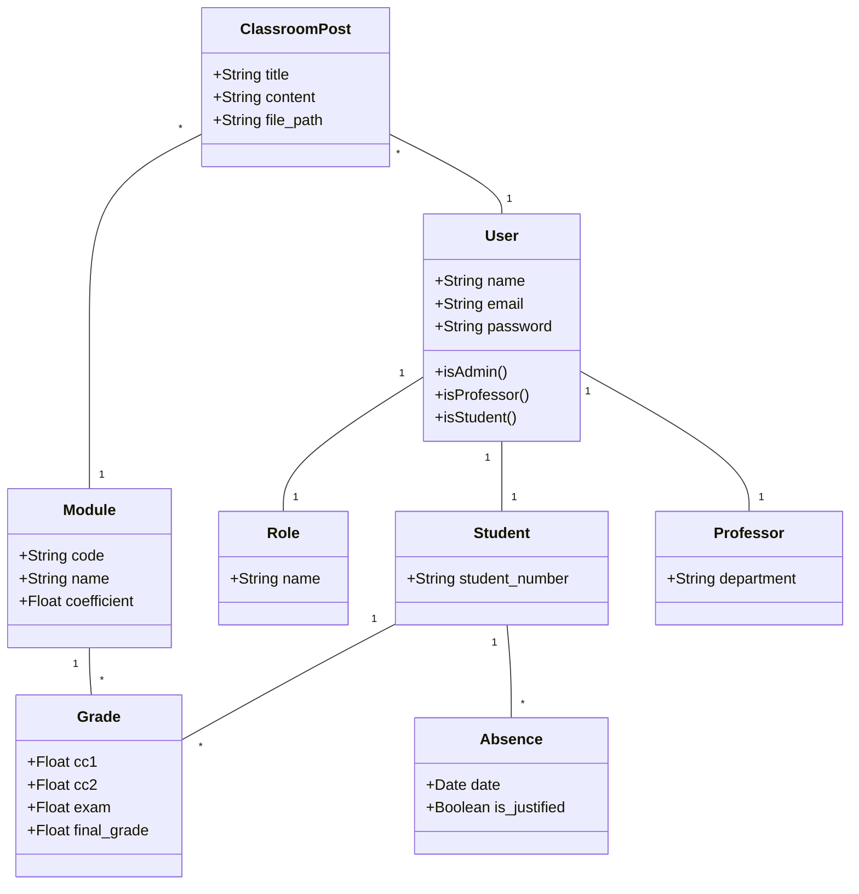
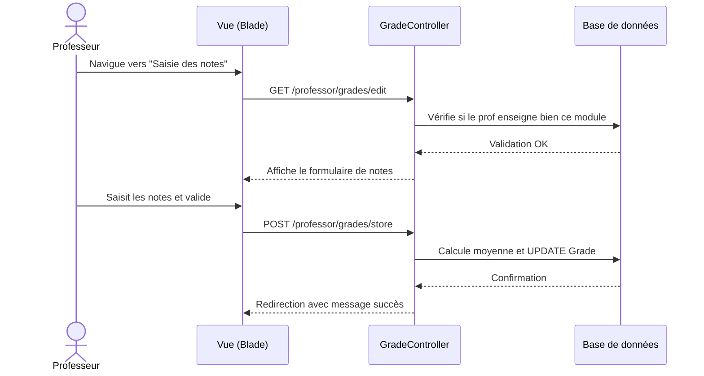
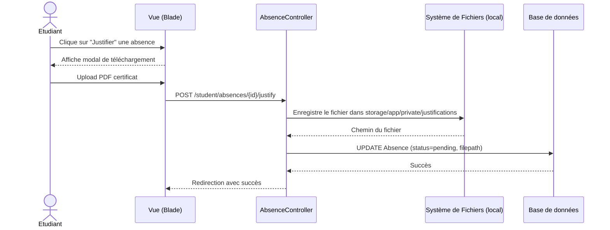

# RAPPORT DE PROJET DE FIN DE MODULE - TW2
## UPF - Université Privée de Fès

**Filière :** Génie Informatique (ou votre filière exacte)  
**Année universitaire :** 2025/2026  
**Réalisé par :** Radouane (ajoutez les autres membres si besoin)  
**Encadré par :** (Nom de votre professeur)  

---

## 📋 Sommaire
1. Introduction
2. Description fonctionnelle de l'application
3. Conception (UML)
4. Modèle de la base de données (MLD/MCD)
5. Architecture technique
6. Captures d'écran commentées
7. Difficultés rencontrées et solutions apportées
8. Conclusion et perspectives d'évolution

---

## 1. Introduction
Dans le cadre du module TW2, il nous a été demandé de concevoir et développer une plateforme complète de **Gestion Universitaire**. L'objectif principal de ce projet est de digitaliser et de centraliser les processus académiques quotidiens : gestion des emplois du temps, suivi des absences, saisie et consultation des notes, espaces de travail virtuels (Classroom) et réservations de salles.
Ce projet s'inscrit dans une démarche de modernisation, visant à offrir un outil ergonomique, sécurisé et réactif aux administrateurs, aux professeurs et aux étudiants.

---

## 2. Description fonctionnelle de l'application
L'application se décline en 3 espaces distincts selon les rôles :

*   **Espace Administration :**
    *   Gestion complète (CRUD et Imports CSV) des utilisateurs, filières, groupes et modules.
    *   Gestion du parc immobilier (Salles) et génération des emplois du temps.
    *   Validation des justificatifs d'absences et traitement des demandes de documents.
    *   Planification automatisée des examens et génération des convocations en PDF.
*   **Espace Professeur :**
    *   Consultation de son propre emploi du temps.
    *   Saisie sécurisée des notes (CC1, CC2, Examen final) avec calcul automatique des moyennes.
    *   Suivi des présences et pointage (Appel) lors de ses séances.
    *   Animation des "Classrooms" virtuels pour partager annonces et supports (PDF, PPT).
    *   Demandes de réservation de salles pour des rattrapages.
*   **Espace Étudiant :**
    *   Accès direct aux plannings, convocations et cahier de textes.
    *   Suivi en temps réel de ses notes.
    *   Consultation de ses absences et dépôt de justificatifs médicaux.
    *   Interaction sur les Classrooms virtuels (commentaires et téléchargements de cours).
    *   Demande d'attestations ou conventions de stage.

---

## 3. Conception

### 3.1 Diagramme de Cas d'Utilisation (Use Case)

```mermaid
usecaseDiagram
    actor Admin
    actor Professeur
    actor Etudiant

    usecase "Gérer les utilisateurs" as UC1
    usecase "Gérer les emplois du temps" as UC2
    usecase "Planifier des examens" as UC3

    usecase "Saisir les notes" as UC4
    usecase "Faire l'appel (Absences)" as UC5
    usecase "Publier un support (Classroom)" as UC6
    
    usecase "Consulter ses notes" as UC7
    usecase "Justifier une absence" as UC8
    usecase "Télécharger un support" as UC9

    Admin --> UC1
    Admin --> UC2
    Admin --> UC3

    Professeur --> UC4
    Professeur --> UC5
    Professeur --> UC6

    Etudiant --> UC7
    Etudiant --> UC8
    Etudiant --> UC9
```

### 3.2 Diagramme de Classes simplifié



### 3.3 Diagrammes de Séquence

**Scénario 1 : Le professeur saisit une note**


**Scénario 2 : L'étudiant dépose un justificatif d'absence**


---

## 4. Modèle de la Base de Données (MLD / MCD)

Le modèle relationnel est dense et s'articule autour des pivots centraux que sont les entités `users`, `groups`, `modules` et `schedules`.

*   **Gestion des rôles :** La table `users` possède une clé étrangère `role_id` vers `roles`.
*   **Héritage d'utilisateurs :** Les tables `students` et `professors` sont liées à `users` en (1:1). `students` est également lié à `groups` en (N:1) et à `academic_years`.
*   **Pédagogie :** `groups` et `modules` appartiennent à une `filiere`.
*   **Affectation (Planning) :** La table `schedules` est la table pivot complexe qui relie `group_id`, `module_id`, `professor_id` et `room_id`.
*   **Évaluation et Assiduité :** La table `grades` est une table de jonction entre `students` et `modules`. La table `absences` appartient à un `student`.
*   **Communication :** La table `classroom_posts` est liée à `module_id`, `group_id` et `user_id`, et possède une relation (1:N) avec `comments`.

> *Toutes les tables bénéficient de contraintes d'intégrité référentielle strictes et d'index optimisés pour accélérer les requêtes de jointure complexes.*

---

## 5. Architecture technique

Le projet a été développé en respectant strictement l'architecture **MVC (Modèle-Vue-Contrôleur)** via le framework **Laravel 12**.

*   **Organisation des dossiers :**
    *   `app/Models/` : Contient l'ensemble de la logique métier et des relations ORM (Eloquent).
    *   `app/Http/Controllers/` : Séparé en sous-dossiers par rôles (`Admin`, `Professor`, `Student`) pour une meilleure séparation des responsabilités (Single Responsibility Principle).
    *   `resources/views/` : Vues structurées avec Blade et stylisées avec **Tailwind CSS**.
*   **Sécurité et Middlewares :**
    *   Mise en place de middlewares stricts (`role:admin`, `role:professor`) bloquant l'accès aux routes non autorisées.
    *   Validation rigoureuse des données (Form Requests) avant chaque insertion.
    *   Stockage privé des fichiers sensibles (justificatifs) inaccessibles publiquement, servis par des routes sécurisées (`Storage::download()`).
*   **Tests Automatisés :** Mise en place de Feature tests PHPUnit validant l'authentification et les restrictions d'accès de bout en bout.

---

## 6. Captures d'écran commentées

*(Note pour la rédaction : Insérez ici vos captures d'écran depuis le dossier du projet)*

*   **Capture 1 - Tableau de Bord Administrateur :** Vue d'ensemble sur les statistiques (Graphes) et raccourcis rapides.
*   **Capture 2 - Emploi du temps interactif :** Interface (FullCalendar) permettant aux professeurs et étudiants de voir leur semaine.
*   **Capture 3 - Saisie des Notes :** Interface sécurisée empêchant le professeur de voir d'autres groupes.
*   **Capture 4 - Classroom :** Espace collaboratif avec fils de discussion et téléchargement sécurisé des supports.

---

## 7. Difficultés rencontrées et solutions apportées

1.  **Gestion complexe des accès aux Classes Virtuelles (Classroom)**
    *   *Problème :* Au départ, les fichiers et posts de classes étaient accessibles par simple modification de l'URL, causant une faille de confidentialité.
    *   *Solution :* Développement d'un Helper statique `ClassroomAuthorization` et d'une méthode de vérification vérifiant précisément que l'étudiant appartient au bon groupe, et que le professeur y enseigne (via la table `schedules`). Les fichiers ont été déplacés du disque public vers le disque local privé et servis par un routeur.
2.  **Violations d'intégrité lors de la création d'utilisateurs (Tests)**
    *   *Problème :* La contrainte de rôle obligatoire (role_id NOT NULL) faisait crasher l'inscription et les tests automatisés (RefreshDatabase).
    *   *Solution :* Modification du `RegisteredUserController` et de la `UserFactory` pour injecter automatiquement un rôle `student` par défaut (`Role::firstOrCreate()`).
3.  **Encodage des caractères (UTF-8)**
    *   *Problème :* Problèmes d'affichage (ex: "Contrôle").
    *   *Solution :* Analyse des scripts d'importation et encodage forcé en UTF-8 des fichiers Blade et des dumps de base de données.

---

## 8. Conclusion et perspectives d'évolution

Le projet répond parfaitement au cahier des charges initial et constitue un socle solide pour un établissement d'enseignement. L'utilisation de Laravel a grandement facilité la structuration du code, garantissant à la fois sécurité et maintenabilité.

**Perspectives :**
*   Intégration d'un système de notification Push (WebSockets via Laravel Reverb).
*   Création d'une application mobile en exploitant les endpoints API (déjà partiellement en place dans `AcademicApiController`).
*   Intégration d'un système de paiement en ligne pour les frais de scolarité.
