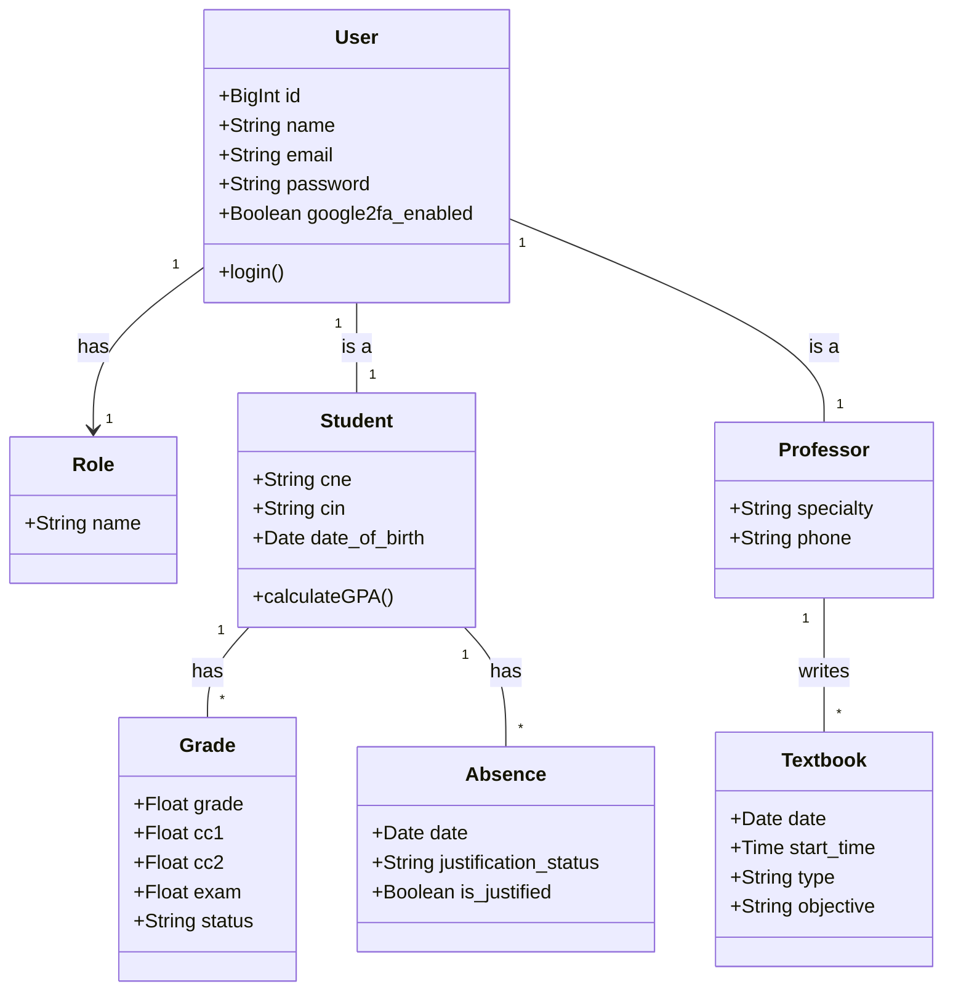
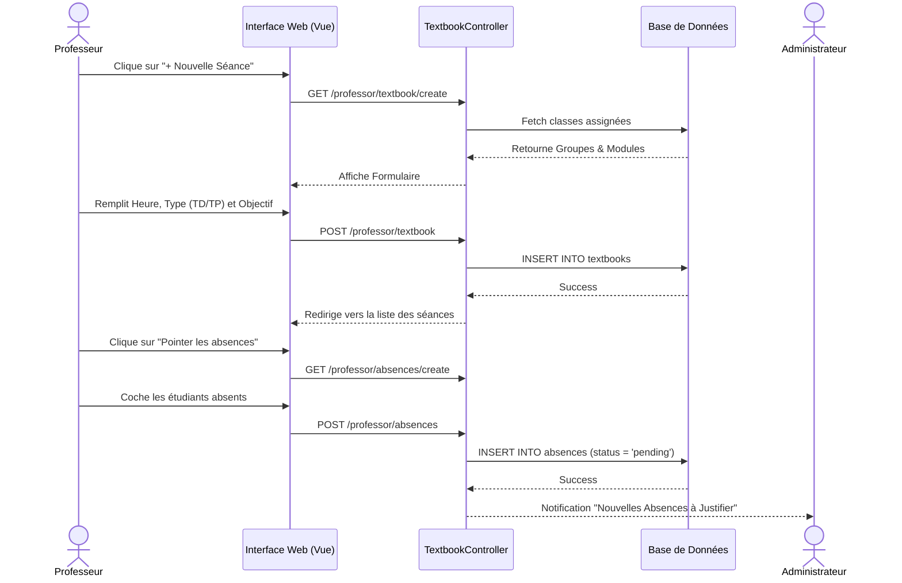
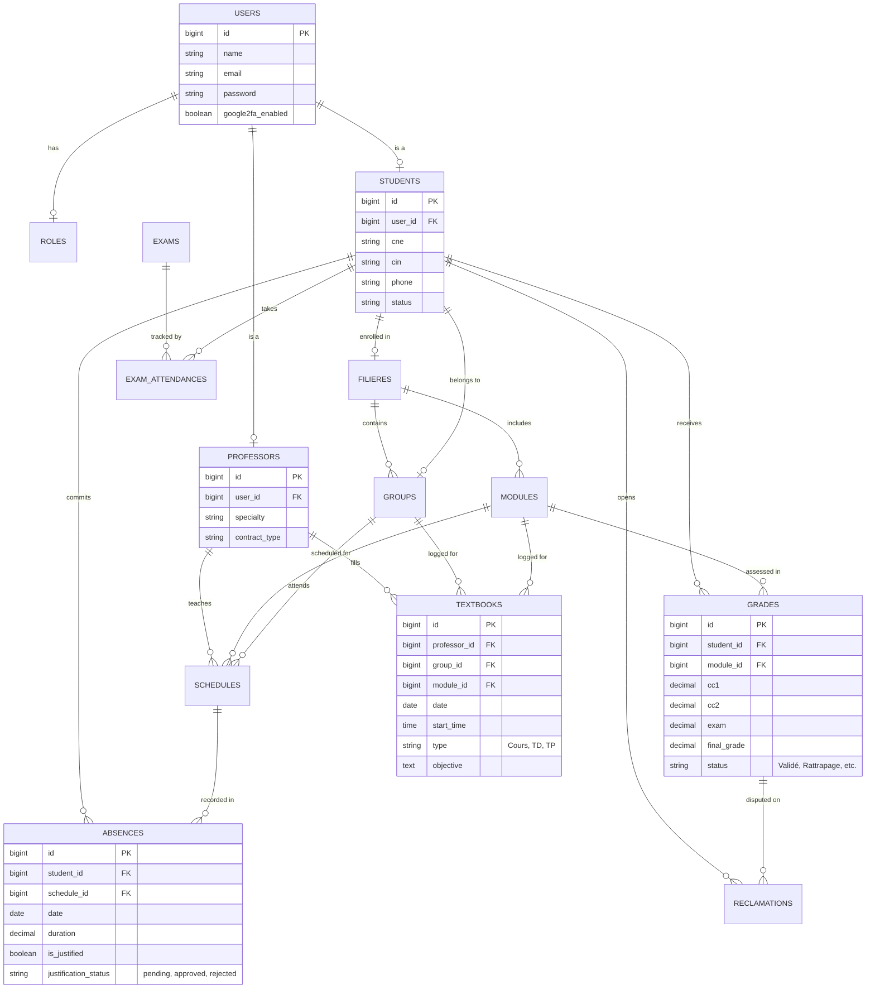
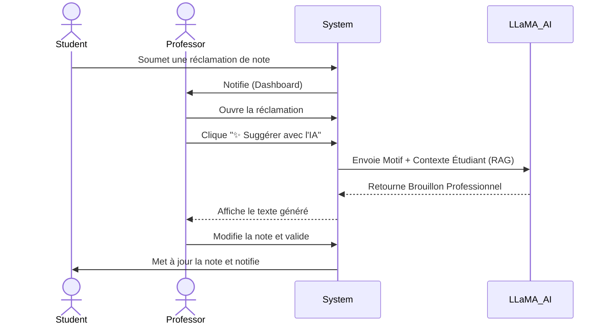
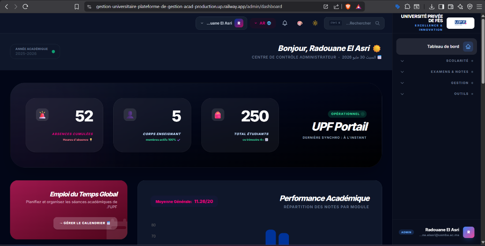

<div align="center">
  <div style="background-color: #4f46e5; color: white; width: 80px; height: 80px; display: inline-flex; justify-content: center; align-items: center; border-radius: 16px; font-size: 2rem; font-weight: 900; margin-bottom: 20px;">U</div>
  <h1>🎓 UPF Portail - Plateforme de Gestion Académique Intelligente</h1>
  <p><strong>Système complet de gestion universitaire propulsé par l'Intelligence Artificielle (LLaMA 3.3) et la sécurité avancée.</strong></p>
  
  [](https://laravel.com)
  [](https://tailwindcss.com/)
  [](https://alpinejs.dev/)
  [](https://groq.com/)
  [](https://web.dev/progressive-web-apps/)
  [](https://github.com/antonioribeiro/google2fa-laravel)
</div>

<br>

---

## 📖 Table des matières
1. [Problématique & Objectif](#1-problématique--objectif)
2. [Fonctionnalités Principales & Scénarios d'Usage](#2-fonctionnalités-principales--scénarios-dusage)
3. [Analyse de Valeur : L'Écosystème Avant / Après](#3-analyse-de-valeur--lécosystème-avant--après)
4. [Architecture du Système & Modélisation UML](#4-architecture-du-système--modélisation-uml)
5. [User Flow / System Flow](#5-user-flow--system-flow)
6. [Project Structure](#6-project-structure)
7. [Documentation Visuelle](#7-documentation-visuelle)
8. [Core Logic / Business Logic](#8-core-logic--business-logic)
9. [API & AI Interaction Layer](#9-api--ai-interaction-layer)
10. [Stratégie de Test & Assurance Qualité (PHPUnit)](#10-stratégie-de-test--assurance-qualité-phpunit)
11. [Installation & Run](#11-installation--run)

---

## 1. Problématique & Objectif 🎯

**Problématique :**  
La gestion académique traditionnelle dans les universités marocaines (comme l'UPF) est souvent fragmentée : traitement manuel des absences, calculs complexes et sujets aux erreurs pour les délibérations (système de compensation, notes éliminatoires), gestion lourde des réclamations étudiantes, et un manque cruel de visibilité (Analytics) pour la prise de décision. De plus, la sécurité des accès administrateurs et l'assistance utilisateur sont souvent laissées de côté.

**Objectif :**  
Créer un portail SaaS (Software as a Service) 100% digital, centralisé, ultra-sécurisé et intelligent. Ce projet vise à automatiser le règlement pédagogique marocain strict tout en intégrant des technologies de pointe telles que l'**Intelligence Artificielle (LLaMA 3.3 via Groq)** pour l'assistance en temps réel multi-rôles, une **Authentification à Double Facteur (2FA)** pour les administrateurs, et la **PWA (Progressive Web App)** pour l'accessibilité mobile native.

---

## 2. Fonctionnalités Principales & Scénarios d'Usage ✨

Le système couvre l'intégralité du cycle de vie universitaire à travers des modules avancés :

### 🤖 1. IA Caméléon : Assistant Multi-Rôles (LLaMA 3.3 RAG)
L'intelligence artificielle n'est pas qu'un simple gadget, elle a été programmée pour changer de comportement, de rôle et de contexte selon l'utilisateur (Technique du **RAG : Retrieval-Augmented Generation**).
*   **Étudiant (Conseiller Académique) :** Un widget de chat flottant. L'IA connaît les notes, la filière et les absences de l'étudiant pour lui fournir un conseil ultra-personnalisé.
*   **Professeur (Assistant Pédagogique) :** L'IA l'assiste dans le panneau des "Réclamations". Un clic sur "✨ Suggérer avec l'IA" rédige un brouillon de réponse diplomatique à l'étudiant.
*   **Administrateur (Super-Secrétaire & Conseiller) :** L'IA génère des "Bilans Pédagogiques" professionnels pour les étudiants à risque, ou rédige des convocations formelles pour les conseils de discipline.

### 🎓 2. Règles de Délibération Marocaines (Système Apogée)
Un moteur métier strict (`PVCompilerTrait`) qui automatise la loi universitaire :
*   **Validation & Compensation :** Validation si Moyenne >= 10. Compensation autorisée si la note du module >= 7/20 (max 2 modules compensés). Une note < 7 entraîne le statut Non Validé (NV).
*   **Gestion des Crédits Modules :** Les étudiants peuvent passer à l'année supérieure avec des dettes (Admis avec Crédit, max 2 modules).
*   **Règle Stricte de Licence (3ème année) :** Annulation de la tolérance de crédit. Validation totale requise pour l'obtention du diplôme.
*   **Affichage Global & Précision des Dates :** Les PV listent tous les étudiants d'une filière, et affichent la précision chronologique avec la balise `Dt. Val./Ex.` (Date de validation ou d'examen).

### 📄 3. Génération PDF Haute Définition & Documents Officiels
*   **Relevé de Notes Officiel :** Génération PDF avec le calcul automatique de la Mention (Passable, Assez Bien, Bien...).
*   **Attestation de Réussite Sécurisée :** Générée pour les étudiants admis (0 dette). Elle contient un **Code QR** scannable qui pointe vers une route publique (`/verify-document`) certifiant l'authenticité du diplôme aux recruteurs.
*   **Convocations d'Examens & Attestations de Travail :** Numéro de place auto-généré pour les étudiants, et attestations pré-remplies pour les professeurs.

### 📋 4. Cahier de Textes & Workflow des Absences
*   **Cahier de Textes Numérique :** Le professeur saisit sa séance (Cours/TD/TP, Objectif).
*   **Pointage Fluide :** Depuis le registre d'appel, le professeur coche les étudiants absents via des *Toggle Buttons*.
*   **Registre Global (Admin) :** L'administration filtre ces absences par Filière/Groupe, gère et valide les justificatifs médicaux, et déclenche des alertes d'exclusion.

### 💬 5. Hub Pédagogique (Classroom)
*   **Devoirs & Soumissions :** Les professeurs publient des devoirs (fichiers PDF/ZIP, consignes, deadline). Les étudiants déposent leurs rendus sécurisés. Le professeur corrige et saisit une appréciation en ligne.
*   **Salon de Discussion par Module :** Un espace de discussion réactif (style Slack/Discord) exclusif aux étudiants d'un module et leur professeur. Requêtes asynchrones optimisées (Alpine.js) pour une fluidité "Temps Réel" sans surcharger le serveur.

### 📊 6. Dashboard Analytique Avancé (Analytics)
Un centre de commande visuel pour la direction de la Faculté (Chart.js) :
*   **Top/Flop Modules :** Bar chart des matières avec le plus fort taux d'échec vs taux de réussite.
*   **Répartition des Absences :** Graphiques de suivi de l'assiduité (Justifiées vs Injustifiées).
*   **Projection des Délibérations :** Estimation en temps réel du pourcentage d'étudiants Admis vs Ajournés selon les notes actuelles.

### 📅 7. Gestion Interactive des Rendez-vous
*   **Générateur Admin :** Génération en 1 clic d'une journée type de créneaux (de 10h00 à 16h30) pour simplifier le planning.
*   **Flux Collaboratif :** Un étudiant demande un RDV direct. Le professeur peut *Accepter* ou faire une *Contre-proposition*. Si une autre heure est suggérée, l'étudiant doit *Valider* depuis son portail pour officialiser la rencontre.

### 🏢 8. Gestion Avancée des Stages
*   **Étudiants :** Dépôt en ligne de la convention de stage (Entreprise, Tuteur) et soumission mensuelle des rapports d'activité.
*   **Administration & Professeurs :** Approbation de la fiche, assignation d'un encadrant académique, dépôt des retours pédagogiques et attribution de la note finale.

### ⚖️ 9. Module de "Demande de Recours" (Réclamations)
*   Dépôt d'un recours par l'étudiant en cas de contestation de note post-affichage (délai de 48h). Tableaux de gestion pour le back-office (En attente, Traité, Rejeté).

### 🗓️ 10. Gestion des Inscriptions, Réinscriptions & Archivage
*   **Contrôle des Périodes d'Inscription :** L'administrateur dispose d'une console de configuration globale pour ouvrir et fermer les dates officielles d'inscription ou de réinscription. Si un étudiant tente de soumettre son dossier hors de cette fenêtre temporelle, le système bloque automatiquement l'accès.
*   **Archivage Annuel (Clôture) :** En fin d'année, après l'édition des PV finaux, le système procède à un archivage complet de l'année universitaire. Les données (Notes, PV, Absences) sont scellées et conservées dans l'historique de l'étudiant, permettant de lancer une nouvelle année académique avec des données fraîches.
*   **Système de Sauvegarde (Backup) :** Génération automatisée et stockage sécurisé de sauvegardes (Dumps) de la base de données relationnelle pour prévenir toute perte de données académiques critiques en cas de crash.

### ☁️ 11. Notifications par E-mail, Temps Réel & Déploiement
*   **Envoi Automatisé d'E-mails (Convocations & Alertes) :** Chaque étudiant reçoit sa **Convocation d'Examen au format PDF directement par E-mail**. Le système utilise le trait `SendsEmailNotification` pour expédier simultanément une notification Push (Navbar) et un e-mail HTML officiel (lors de la publication des notes, des absences, ou des réponses aux réclamations).
*   **Badges Temps Réel (Navbar) :** Une cloche de notification qui vibre via interrogation asynchrone (Alpine.js) lors d'une nouvelle alerte.
*   **Hébergement (Railway) & Serveur Mail (Resend) :** Déploiement robuste en production. Configuration de `Resend` avec le nom de domaine de l'université pour garantir une délivrabilité parfaite (0 spam) des e-mails transactionnels.

### 🛡️ 12. Sécurité Militaire & Expérience PWA
*   **Google 2FA :** Verrouillage de l'accès Administrateur avec code dynamique (QR Code).
*   **PWA (Progressive Web App) :** Bouton "Installer l'Application" pour les étudiants, accès direct depuis l'écran d'accueil du smartphone et gestion du cache hors-ligne via un *Service Worker*.

---

## 3. Analyse de Valeur : L'Écosystème Avant / Après 👥

Le portail a été pensé pour résoudre les frustrations quotidiennes de chaque acteur de l'université. Voici comment la plateforme transforme leur expérience :

### 👨‍💼 L'Administrateur (Scolarité)
*   **Avant (Problématique) :** Noyé sous la paperasse. Perte de temps à vérifier les certificats médicaux papier, à courir après les professeurs pour récupérer les notes, et à calculer manuellement (et péniblement) les moyennes sur Excel lors des délibérations.
*   **Maintenant (Facilitation) :** Tout est centralisé sur un Dashboard Analytics visuel. 
*   **Le Bénéfice :** Il gagne un temps précieux. Le calcul des PV se fait en un clic (sans erreur humaine). Les absences sont consolidées en temps réel. Grâce au système d'IA, il rédige ses e-mails officiels et rapports disciplinaires en quelques secondes. C'est le chef d'orchestre ultime.

### 👨‍🏫 Le Professeur
*   **Avant (Problématique) :** Saisie redondante. Devoir signer le cahier de textes papier à la scolarité, faire l'appel sur une feuille volante souvent perdue, et gérer le stress des étudiants qui se plaignent de leurs notes à la fin des cours ou par WhatsApp.
*   **Maintenant (Facilitation) :** Il gère tout depuis son téléphone (PWA) ou son ordinateur.
*   **Le Bénéfice :** Saisie du cahier de textes et pointage des absences en 3 clics pendant le cours. Lorsqu'un étudiant fait une "Réclamation de Note", celle-ci tombe dans une boîte de réception propre et structurée. Mieux encore : l'IA LLaMA lui rédige un brouillon de réponse diplomatique (qu'il valide ou modifie) pour clore le débat sans perdre de temps.

### 👨‍🎓 L'Étudiant
*   **Avant (Problématique) :** Le flou total. Aucune visibilité sur ses notes avant l'affichage papier, ignorance de son taux d'absence ("Suis-je exclu du module ?"), et impossibilité de communiquer avec l'administration sans faire la queue pendant 2 heures au guichet de la scolarité.
*   **Maintenant (Facilitation) :** Une application mobile PWA dans sa poche, fluide et instantanée.
*   **Le Bénéfice :** Totale transparence. Il voit sa progression académique (GPA), ses absences justifiées/non-justifiées, et reçoit ses convocations PDF et ses e-mails d'alerte en temps réel. S'il a un doute, il pose la question au Chatbot IA "Smart UPF" qui connaît son dossier et lui répond à toute heure de la nuit.

### ⚙️ Le Système (La Machine)
*   **Le Rôle Exact :** Le système n'est pas qu'une base de données morte, c'est un moteur de règles actif (`PVCompilerTrait`). Il écoute les actions, applique les règles de l'enseignement supérieur marocain (seuils d'élimination, calculs des coefficients CC/Examens), orchestre les envois d'emails (via Resend), sécurise les accès via 2FA, et lie le tout au cerveau analytique de l'Intelligence Artificielle (Groq).

---

## 4. Architecture du Système & Modélisation UML 🏗️

Afin de garantir une scalabilité et une maintenance optimale, le projet suit une architecture MVC renforcée et est modélisé de manière stricte. Voici les diagrammes de conception (UML) :

### 4.1. Diagramme de Cas d'Utilisation (Use Case)
Le système gère 3 acteurs principaux avec des niveaux de permissions distincts :

```mermaid
usecaseDiagram
    actor "Administrateur" as Admin
    actor "Professeur" as Prof
    actor "Étudiant" as Student

    package "UPF Portail" {
        usecase "Gérer les Utilisateurs & Salles" as UC1
        usecase "Générer les PV et Délibérations" as UC2
        usecase "Saisir le Cahier de Textes" as UC3
        usecase "Pointer les Absences" as UC4
        usecase "Saisir les Notes" as UC5
        usecase "Consulter les Notes & Absences" as UC6
        usecase "Faire une Réclamation" as UC7
        usecase "Discuter avec l'IA Smart UPF" as UC8
    }

    Admin --> UC1
    Admin --> UC2
    Admin --> UC8
    
    Prof --> UC3
    Prof --> UC4
    Prof --> UC5
    Prof --> UC8

    Student --> UC6
    Student --> UC7
    Student --> UC8
```

### 4.2. Diagramme de Classes (Class Diagram)
Aperçu du schéma relationnel (Base de données) via Eloquent ORM :



### 4.3. Flux Séquentiel : Saisie d'une Séance & Pointage (Sequence Diagram)
Le scénario complet de digitalisation du Cahier de Textes par le professeur, suivi du pointage des étudiants :



### 4.4. Architecture Globale (MVC + Services)
L'application suit l'architecture classique **MVC (Model-View-Controller)** de Laravel, enrichie par le **Pattern Repository/Service** pour la logique complexe.

```mermaid
graph TD
    Client[Client Browser / PWA] -->|HTTP/HTTPS| Router[Laravel Router]
    Router --> Middleware[Auth, Role, 2FA Middleware]
    Middleware --> Controller[Controllers]
    
    subgraph Core Application
        Controller --> Services[Services Layer (LlamaAiService)]
        Services --> Traits[PVCompilerTrait]
        Controller --> Models[Eloquent ORM]
    end
    
    subgraph External APIs
        Services -.->|API REST / Groq| AI[LLaMA 3.3 API]
    end
    
    Models --> DB[(MySQL / MariaDB)]
    Controller --> Views[Blade Templates + Alpine.js]
    Views --> Client
```

### 4.5. Modèle de Base de Données (Entité-Relation / ERD)
La base de données est hautement normalisée pour supporter toutes les exigences académiques. Voici le dictionnaire des données principal (Entity Relationship Diagram) :



#### Dictionnaire des Tables Clés :
Le projet compte plus de **35 tables**, classées en 4 grands pôles :
1. **Pôle Utilisateurs & Accès :** `users`, `roles`, `personal_access_tokens` (Sécurité API & 2FA).
2. **Pôle Académique (Scolarité) :** `filieres` (Filières d'études), `modules` (Matières), `groups` (Classes), `academic_years`, `semesters` (Gestion temporelle).
3. **Pôle Pédagogique (Cours & Examens) :** `schedules` (Emplois du temps), `textbooks` (Cahiers de textes), `absences`, `grades` (Notes & CC), `exams` (Planification des examens), `exam_attendances` (Émargements).
4. **Pôle Communication & Démarches :** `reclamations` (Réclamations de notes), `appointments` (Rendez-vous étudiants-profs), `classroom_posts` & `classroom_messages` (Communication).

---

## 5. User Flow / System Flow 🔄

Voici le flux principal de traitement d'une **Réclamation de Note** avec assistance IA :



---

## 6. Project Structure 📂

Architecture des dossiers clés du projet :

```text
📦 UPF Portail
 ┣ 📂 app
 ┃ ┣ 📂 Http/Controllers
 ┃ ┃ ┣ 📂 Admin (AnalyticsController, AbsenceController, TwoFactorAuthController...)
 ┃ ┃ ┣ 📂 Professor (ReclamationController, TextbookController...)
 ┃ ┃ ┗ 📂 Student (AiChatController, ScheduleController...)
 ┃ ┣ 📂 Models (User, Student, Professor, Textbook, Absence, Grade...)
 ┃ ┣ 📂 Services (LlamaAiService...)
 ┃ ┗ 📂 Traits (PVCompilerTrait)
 ┣ 📂 database
 ┃ ┣ 📂 migrations (Structuration relationnelle rigoureuse)
 ┃ ┗ 📂 seeders (Générateur massif de data réaliste : 250 Étudiants, Profs, Admins)
 ┣ 📂 public
 ┃ ┣ 📜 manifest.json (Configuration PWA)
 ┃ ┗ 📜 sw.js (Service Worker)
 ┣ 📂 resources
 ┃ ┣ 📂 views
 ┃ ┃ ┣ 📂 auth (Login, Google 2FA Setup & Verify)
 ┃ ┃ ┣ 📂 components (ai-chat-widget.blade.php, primary-button.blade.php)
 ┃ ┃ ┗ ... (Vues structurées par rôle)
 ┗ 📜 routes/web.php (Routage sécurisé par middleware)
```

---

## 7. Documentation Visuelle 🖼️

Voici un aperçu visuel des différentes interfaces de l'application et des documents officiels générés en haute définition :

### 🌟 Interfaces Portails & Sécurité
| **Double Authentification (2FA) Admin** | **Assistant IA Multi-Rôles** |
| :---: | :---: |
| (Capture d\'écran Configuration 2FA)</i>'"> | (Capture d\'écran du Chat IA Contextuel)</i>'"> |
| *Verrouillage militaire des accès administrateurs avec Google Authenticator.* | *L'IA Smart UPF intégrée de manière globale pour tous les utilisateurs avec contexte RAG.* |

<br>

| **Tableau de Bord Administration (Support RTL Arabe Complet)** |
| :---: |
| (Capture d\'écran Admin RTL)</i>'"> |
| *Mise en page RTL native, Traduction complète, Sidebar et Topbar inversés de manière fluide* |

---

## 8. Core Logic / Business Logic 🧠

La pièce maîtresse du système académique se trouve dans le `App\Traits\PVCompilerTrait`. 
Au lieu de dupliquer la logique dans chaque contrôleur, ce trait agit comme le **moteur de règles académiques unique** de l'université.

**Règles implémentées :**
*   Calcul de la moyenne finale (`(CC1 * 0.2) + (CC2 * 0.2) + (Exam * 0.6)`).
*   **Condition de Validation :** Moyenne >= 10 et aucune note éliminatoire (< 5).
*   **Compensation :** Un module < 10 (mais > 5) peut être validé par compensation si la moyenne générale du semestre est >= 10.
*   **Rattrapage :** Les modules non validés ni compensés sont automatiquement marqués pour la session de rattrapage.

---

## 9. API & AI Interaction Layer 🌐

L'application interagit avec l'API Groq (compatible OpenAI) pour faire tourner les modèles **LLaMA 3.3 (70B)** à une vitesse fulgurante.

Le fichier `App\Services\LlamaAiService.php` centralise les appels HTTP (via la façade `Http` de Laravel).
Nous utilisons la technique **RAG (Retrieval-Augmented Generation)** : avant d'interroger l'IA, le serveur injecte le contexte de la base de données (Notes, Filière, Motif, Spécialité du Professeur ou Privilèges Admin) dans le `System Prompt` pour forcer l'IA à répondre sur des faits réels et à s'adapter au profil connecté.

---

## 10. Stratégie de Test & Assurance Qualité (PHPUnit) 🧪

La fiabilité de la plateforme est garantie par une suite de tests unitaires et fonctionnels (Feature Tests) développée avec **PHPUnit**. Nous avons simulé les scénarios critiques pour les trois acteurs principaux afin d'éviter toute régression.

### 🛡️ Tests de Sécurité & Authentification (Admin)
*   **Test de la 2FA (Double Authentification) :** Vérification stricte qu'un administrateur possédant le bon mot de passe est systématiquement bloqué s'il ne fournit pas le code *Google Authenticator* valide.
*   **Test d'Autorisation (Middlewares) :** Vérification qu'un étudiant essayant d'accéder à la route `/admin/dashboard` ou `/professor/textbook` reçoit une erreur 403 (Unauthorized), garantissant l'étanchéité des rôles.

### 🎓 Tests de la Logique Métier (Système Apogée)
*   **Test du Moteur de Délibération (`PVCompilerTrait`) :**
    *   **Scénario de Validation :** Vérification qu'un étudiant avec une moyenne de 12/20 obtient le statut "Admis".
    *   **Scénario de Compensation :** Vérification qu'un étudiant avec 8/20 dans un module et 13/20 de moyenne générale voit son module validé par compensation.
    *   **Scénario de Note Éliminatoire :** Vérification qu'une note de 4/20 bloque la validation du semestre (NV), même si la moyenne générale est de 14/20.

### 👨‍🏫 Tests Fonctionnels : Professeurs & Étudiants
*   **Scénarios Professeurs :** Simulation de création d'une séance dans le Cahier de Textes et soumission d'une liste d'absences. Vérification de l'insertion correcte en base de données.
*   **Scénarios Étudiants :** Simulation du dépôt d'une réclamation de note. Vérification que le statut passe bien à "en attente" (`pending`) et qu'une notification en base de données (ainsi qu'un e-mail) est générée pour le professeur concerné.

---

## 11. Installation & Run 🚀

Suivez ces étapes pour déployer le projet en local :

```bash
# 1. Cloner le repository
git clone https://github.com/radouane99/Gestion-Universitaire-Plateforme-de-gestion-acad-mique.git
cd Gestion-Universitaire-Plateforme-de-gestion-acad-mique

# 2. Installer les dépendances PHP et Node
composer install
npm install

# 3. Configurer l'environnement
cp .env.example .env
# -> N'oubliez pas d'ajouter votre clé API IA dans le fichier .env : 
# GROQ_API_KEY=votre_cle_ici

# 4. Générer la clé de l'application
php artisan key:generate

# 5. Lancer la migration et peupler la base de données (Seeder)
# Le seeder va générer automatiquement Radouane en tant qu'Admin ainsi que 250 étudiants.
php artisan migrate:fresh --seed

# 6. Compiler les assets frontend
npm run dev

# 7. Lancer le serveur local
php artisan serve
```

---
<div align="center">
  <p>Développé avec ❤️ pour l'innovation académique.</p>
</div>
