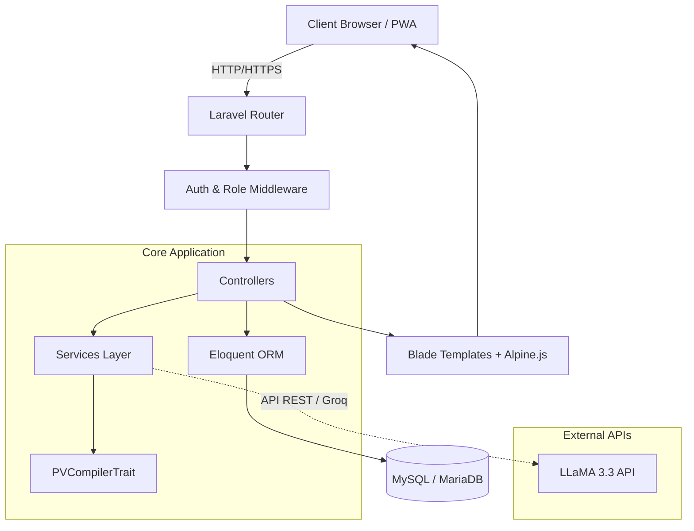
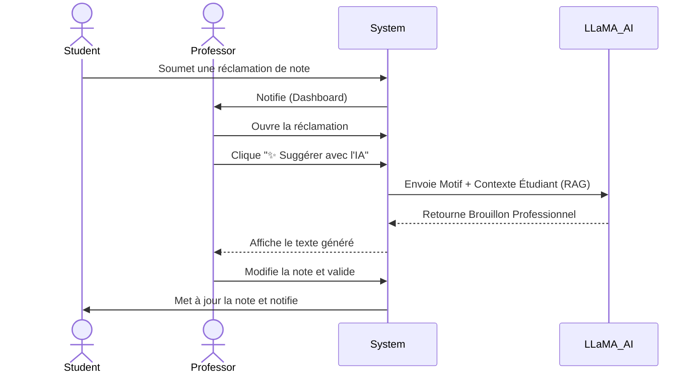
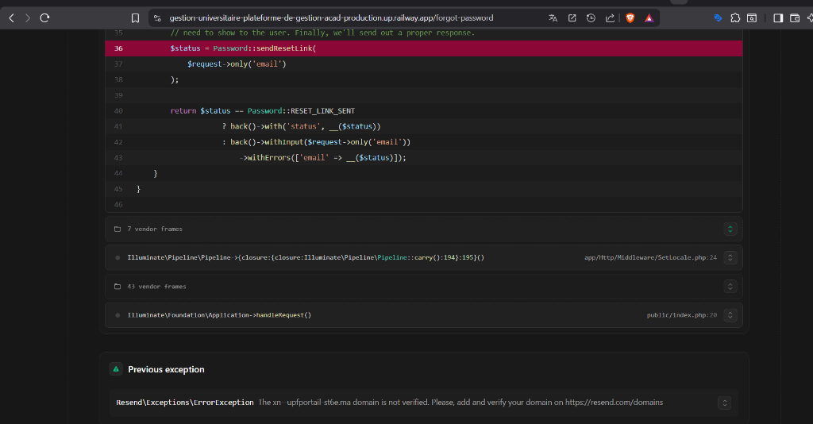
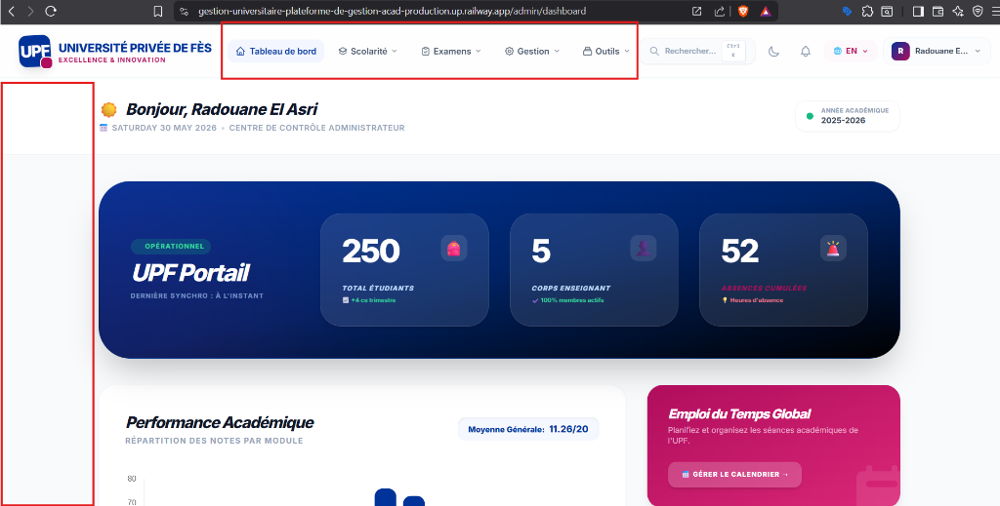
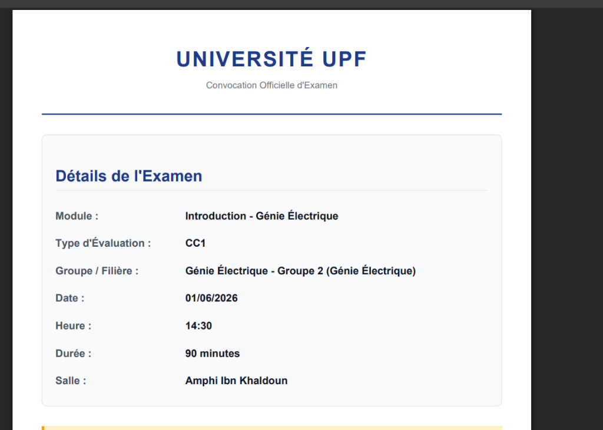
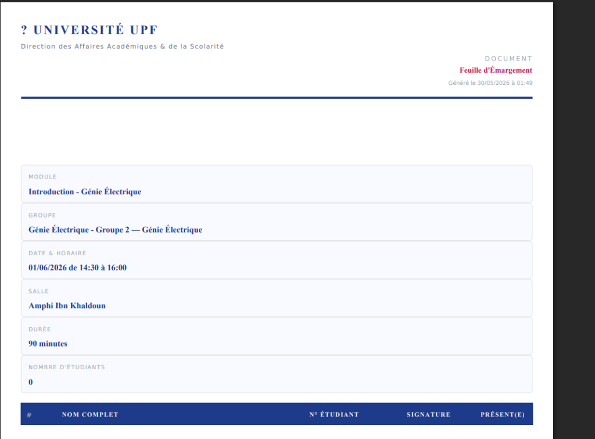
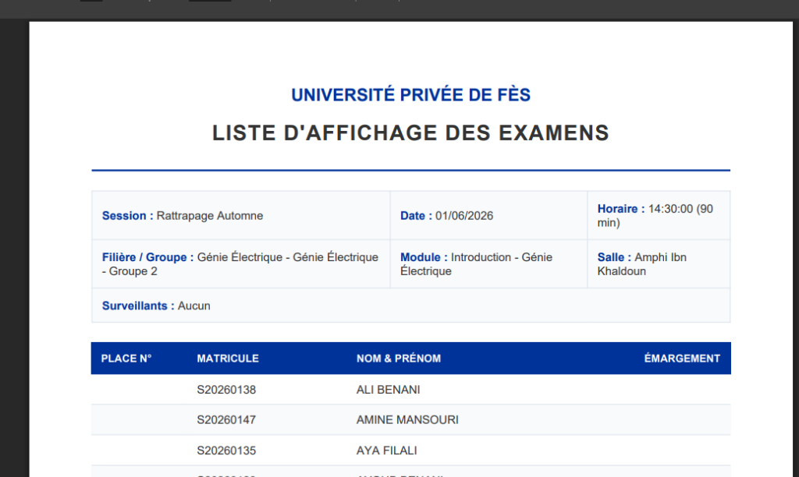

<div align="center">
  <div style="background-color: #4f46e5; color: white; width: 80px; height: 80px; display: inline-flex; justify-content: center; align-items: center; border-radius: 16px; font-size: 2rem; font-weight: 900; margin-bottom: 20px;">U</div>
  <h1>🎓 UPF Portail - Plateforme de Gestion Académique IA</h1>
  <p><strong>Système complet de gestion universitaire propulsé par l'Intelligence Artificielle (LLaMA 3.3).</strong></p>
  
  [](https://laravel.com)
  [](https://tailwindcss.com/)
  [](https://alpinejs.dev/)
  [](https://groq.com/)
  [](https://web.dev/progressive-web-apps/)
</div>

<br>

---

## 📖 Table des matières
1. [Problématique & Objectif](#1-problématique--objectif)
2. [Key Features](#2-key-features)
3. [System Architecture](#3-system-architecture)
4. [User Flow / System Flow](#4-user-flow--system-flow)
5. [Project Structure](#5-project-structure)
6. [Documentation Visuelle](#6-documentation-visuelle)
7. [Core Logic / Business Logic](#7-core-logic--business-logic)
8. [API & AI Interaction Layer](#8-api--ai-interaction-layer)
9. [Installation & Run](#9-installation--run)
10. [Testing Strategy](#10-testing-strategy)
11. [FAQ](#11-faq)

---

## 1. Problématique & Objectif 🎯

**Problématique :**  
La gestion académique traditionnelle dans les universités marocaines (comme l'UPF) est souvent fragmentée : traitement manuel des absences, calculs complexes et sujets aux erreurs pour les délibérations (système de compensation, notes éliminatoires), gestion lourde des réclamations étudiantes, et un manque cruel de visibilité (Analytics) pour la prise de décision.

**Objectif :**  
Créer un portail SaaS (Software as a Service) 100% digital, centralisé et intelligent. Ce projet vise à automatiser le règlement pédagogique marocain strict tout en intégrant des technologies de pointe telles que l'**Intelligence Artificielle (LLaMA 3.3 via Groq)** pour l'assistance en temps réel, et la **PWA (Progressive Web App)** pour l'accessibilité mobile.

---

## 2. Key Features ✨

*   🤖 **Intégration Intelligence Artificielle (RAG)**
    *   **Smart UPF Assistant :** Chatbot IA pour les étudiants qui connaît leurs notes et leurs absences.
    *   **Générateur de Réponses :** L'IA rédige des brouillons diplomatiques pour les professeurs traitant des réclamations.
    *   **Bilan Pédagogique :** Génération automatique d'un rapport textuel sur la situation académique d'un étudiant pour l'administration.
*   ⚖️ **Moteur de Délibération Automatique**
    *   Calcul strict des moyennes, statuts de compensation (ex: compensé si Moyenne > 10, pas de note < 5), et éligibilité aux rattrapages.
*   📄 **Documents Officiels Sécurisés**
    *   Génération de Relevés de Notes et Attestations de Réussite en PDF avec un **Code QR** anti-fraude.
*   📈 **Dashboard Analytics Avancé**
    *   Top/Flop des modules (Chart.js), taux de réussite, et tracking visuel des absences.
*   📱 **Progressive Web App (PWA)**
    *   L'application est installable directement sur smartphone/bureau sans passer par un store (Manifest & Service Worker).
*   🔄 **Workflow de Réclamations & Convocations**
    *   Gestion de bout en bout des réclamations de notes (Étudiant -> Professeur) et des convocations aux rattrapages.

---

## 3. System Architecture 🏗️

L'application suit l'architecture classique **MVC (Model-View-Controller)** de Laravel, enrichie par le **Pattern Repository/Service** pour la logique complexe.



---

## 4. User Flow / System Flow 🔄

Voici le flux principal de traitement d'une **Réclamation de Note** avec assistance IA :



---

## 5. Project Structure 📂

Architecture des dossiers clés du projet :

```text
📦 Examen final laravel
 ┣ 📂 app
 ┃ ┣ 📂 Http/Controllers
 ┃ ┃ ┣ 📂 Admin (AnalyticsController, PVGlobalController, AiAdminController...)
 ┃ ┃ ┣ 📂 Professor (ReclamationController, AiProfessorController...)
 ┃ ┃ ┗ 📂 Student (AiChatController...)
 ┃ ┣ 📂 Models (Student, Grade, Absence, Reclamation...)
 ┃ ┣ 📂 Services (LlamaAiService, RetakeEligibilityService...)
 ┃ ┗ 📂 Traits (PVCompilerTrait)
 ┣ 📂 database
 ┃ ┣ 📂 migrations (Structuration relationnelle rigoureuse)
 ┃ ┗ 📂 seeders (DatabaseSeeder : Générateur massif de data réaliste)
 ┣ 📂 public
 ┃ ┣ 📜 manifest.json (Configuration PWA)
 ┃ ┗ 📜 sw.js (Service Worker)
 ┣ 📂 resources
 ┃ ┣ 📂 views
 ┃ ┃ ┣ 📂 pdf (Vues d'exportation avec DOMPDF)
 ┃ ┃ ┣ 📂 components (ai-chat-widget.blade.php)
 ┃ ┃ ┗ ... (Vues structurées par rôle)
 ┗ 📜 routes/web.php (Routage sécurisé par middleware)
```

---

## 6. Documentation Visuelle 🖼️

Voici un aperçu visuel des différentes interfaces de l'application et des documents officiels générés en haute définition :

### 🌟 Interfaces Portails & Dashboards
| **Landing Page de l'Université (SaaS & PWA)** | **Portail Étudiant (Pro Max Plus)** |
| :---: | :---: |
|  |  |
| *Design Premium, Hero Banner glowing, PWA ready* | *GPA Simulator Alpine.js, Accent Theme Switcher, Spotlight Command Center* |

<br>

| **Tableau de Bord Administration (Support RTL Arabe Complet)** |
| :---: |
|  |
| *Mise en page RTL native, Traduction complète, Sidebar et Topbar inversés de manière fluide* |

<br>

### 📄 Documents Officiels Générés (Exports PDF Professionnels avec Logo)
| **Convocation Officielle d'Examen** | **Feuille d'Émargement des Examens** | **Liste d'Affichage des Examens (Places)** |
| :---: | :---: | :---: |
|  |  |  |
| *En-tête avec logo officiel local, QR Code anti-fraude, signature et cachet circulaire* | *Logo local, Colonne CIN ajoutée pour conformité académique marocaine* | *Logo local, Arqam de Places auto-générés séquentiellement* |

---

---

## 7. Core Logic / Business Logic 🧠

La pièce maîtresse du système académique se trouve dans le `App\Traits\PVCompilerTrait`. 
Au lieu de dupliquer la logique dans chaque contrôleur, ce trait agit comme le **moteur de règles académiques unique** de l'université.

**Règles implémentées :**
*   Calcul de la moyenne finale (`(CC1 * 0.2) + (CC2 * 0.2) + (Exam * 0.6)`).
*   **Condition de Validation :** Moyenne >= 10 et aucune note éliminatoire (< 5).
*   **Compensation :** Un module < 10 (mais > 5) peut être validé par compensation si la moyenne générale du semestre est >= 10.
*   **Rattrapage :** Les modules non validés ni compensés sont automatiquement marqués pour la session de rattrapage.

```php
// Extrait conceptuel de la logique
if ($moyenne >= 10 && !$hasEliminatoryGrades) {
    $status = 'Validé';
} elseif ($moyenneGenerale >= 10 && $moyenne >= 5) {
    $status = 'Validé par Compensation (VC)';
} else {
    $status = 'Rattrapage';
}
```

---

## 8. API & AI Interaction Layer 🌐

L'application interagit avec l'API Groq (compatible OpenAI) pour faire tourner les modèles **LLaMA 3.3 (70B)** à une vitesse fulgurante.

Le fichier `App\Services\LlamaAiService.php` centralise les appels HTTP (via la façade `Http` de Laravel).
Nous utilisons la technique **RAG (Retrieval-Augmented Generation)** : avant d'interroger l'IA, le serveur injecte le contexte de la base de données (Notes, Filière, Motif) dans le `System Prompt` pour forcer l'IA à répondre sur des faits réels de l'étudiant.

---

## 9. Installation & Run 🚀

Suivez ces étapes pour déployer le projet en local :

```bash
# 1. Cloner le repository
git clone https://github.com/radouane99/Gestion-Universitaire-Plateforme-de-gestion-acad-mique.git
cd Gestion-Universitaire-Plateforme-de-gestion-acad-mique

# 2. Installer les dépendances PHP et Node
composer install
npm install

# 3. Configurer l'environnement
cp .env.example .env
# -> N'oubliez pas d'ajouter votre clé API IA dans le fichier .env : 
# GROQ_API_KEY=votre_cle_ici

# 4. Générer la clé de l'application
php artisan key:generate

# 5. Lancer la migration et peupler la base de données (Seeder)
php artisan migrate:fresh --seed

# 6. Compiler les assets frontend
npm run dev

# 7. Lancer le serveur local
php artisan serve
```

> **Comptes de test générés par le Seeder :**
> - **Admin** : `admin@university.com` / `ChangeMe123!`
> - **Professeur** : `prof@university.com` / `ChangeMe123!`
> - **Étudiant** : `student@university.com` / `ChangeMe123!`

---

## 10. Testing Strategy 🧪

*   **Pest / PHPUnit :** Tests unitaires pour valider les règles académiques (ex: tester qu'un étudiant avec 4.5/20 part bien en rattrapage même si sa moyenne générale est de 14).
*   **Tests de Concurrence :** Assurer que les réservations de salles ne se chevauchent pas (`ExamConflictChecker`).
*   **Validation Frontend :** Validation rigoureuse des formulaires et gestion des erreurs de requêtes réseau pour le chat IA.

---

## 11. FAQ ❓

**L'application nécessite-t-elle internet ?**
Oui, pour l'interaction avec le modèle IA (Groq). Cependant, grâce au Service Worker (PWA), la coquille de l'application peut se charger hors-ligne (page *offline*).

**Peut-on exporter les PV au format Excel ?**
Absolument. En plus du format PDF, l'administration dispose d'un bouton d'export Excel pour traiter les données globalement.

**Comment les codes QR sont-ils générés ?**
Nous utilisons le package `simplesoftwareio/simple-qrcode`. Le code pointe vers une URL (fictive dans cette démo) pour vérifier l'authenticité du document crypté.

---
<div align="center">
  <p>Développé avec ❤️ pour l'innovation académique.</p>
</div>
