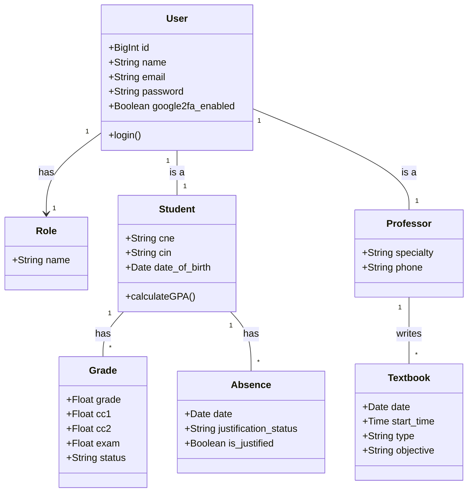
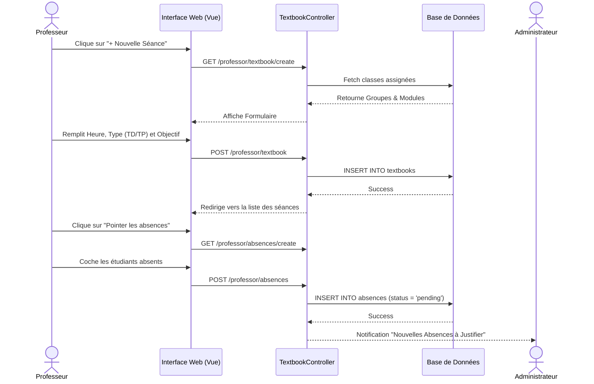
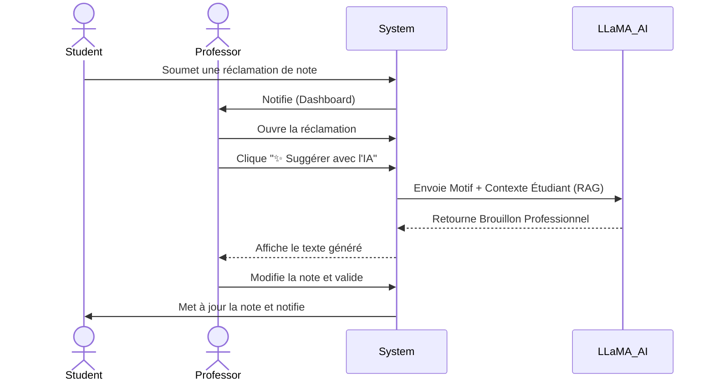

<div align="center">
  <div style="background-color: #4f46e5; color: white; width: 80px; height: 80px; display: inline-flex; justify-content: center; align-items: center; border-radius: 16px; font-size: 2rem; font-weight: 900; margin-bottom: 20px;">U</div>
  <h1>🎓 UPF Portail - Plateforme de Gestion Académique Intelligente</h1>
  <p><strong>Système complet de gestion universitaire propulsé par l'Intelligence Artificielle (LLaMA 3.3) et la sécurité avancée.</strong></p>
  
  [](https://laravel.com)
  [](https://tailwindcss.com/)
  [](https://alpinejs.dev/)
  [](https://groq.com/)
  [](https://web.dev/progressive-web-apps/)
  [](https://github.com/antonioribeiro/google2fa-laravel)
</div>

<br>

---

## 📖 Table des matières
1. [Problématique & Objectif](#1-problématique--objectif)
2. [Fonctionnalités Principales & Scénarios d'Usage](#2-fonctionnalités-principales--scénarios-dusage)
3. [System Architecture](#3-system-architecture)
4. [User Flow / System Flow](#4-user-flow--system-flow)
5. [Project Structure](#5-project-structure)
6. [Documentation Visuelle](#6-documentation-visuelle)
7. [Core Logic / Business Logic](#7-core-logic--business-logic)
8. [API & AI Interaction Layer](#8-api--ai-interaction-layer)
9. [Installation & Run](#9-installation--run)

---

## 1. Problématique & Objectif 🎯

**Problématique :**  
La gestion académique traditionnelle dans les universités marocaines (comme l'UPF) est souvent fragmentée : traitement manuel des absences, calculs complexes et sujets aux erreurs pour les délibérations (système de compensation, notes éliminatoires), gestion lourde des réclamations étudiantes, et un manque cruel de visibilité (Analytics) pour la prise de décision. De plus, la sécurité des accès administrateurs et l'assistance utilisateur sont souvent laissées de côté.

**Objectif :**  
Créer un portail SaaS (Software as a Service) 100% digital, centralisé, ultra-sécurisé et intelligent. Ce projet vise à automatiser le règlement pédagogique marocain strict tout en intégrant des technologies de pointe telles que l'**Intelligence Artificielle (LLaMA 3.3 via Groq)** pour l'assistance en temps réel multi-rôles, une **Authentification à Double Facteur (2FA)** pour les administrateurs, et la **PWA (Progressive Web App)** pour l'accessibilité mobile native.

---

## 2. Fonctionnalités Principales & Scénarios d'Usage ✨

### 🤖 1. IA Caméléon : Assistant Multi-Rôles (LLaMA 3.3 RAG)
L'intelligence artificielle n'est pas qu'un simple gadget, elle a été programmée pour changer de comportement, de rôle et de contexte de base de données selon la personne connectée (Technique du **RAG : Retrieval-Augmented Generation**).

*   **Scénario Étudiant : Le Conseiller Académique**
    *   *L'étudiant demande :* "Est-ce que je valide mon année ?"
    *   *Réponse IA :* Le chatbot analyse discrètement les notes et absences de l'étudiant via la BDD. Il lui répond de façon personnalisée : "Bonjour Ahmed, vous avez actuellement 12/20 en Java mais 3 absences non justifiées. Attention, le règlement stipule que..."
*   **Scénario Professeur : L'Assistant Pédagogique**
    *   *Le professeur demande :* "Donne-moi une idée de TP en Python pour mes 1ère année."
    *   *Réponse IA :* L'IA se met en mode Professeur. Elle connaît la spécialité du professeur et lui génère une suggestion de TP ciblée, ou l'aide à rédiger un e-mail professionnel pour convoquer une classe.
*   **Scénario Administrateur : Le Super-Secrétaire**
    *   *L'admin demande :* "Rédige une convocation formelle pour un conseil de discipline."
    *   *Réponse IA :* Conscient des pouvoirs de l'administrateur, l'IA génère instantanément un modèle officiel d'e-mail ou de lettre adapté au jargon universitaire marocain.

### 🛡️ 2. Sécurité Militaire : Google 2FA (Double Authentification)
La plateforme manipule des données sensibles (Notes, Diplômes). Nous avons donc verrouillé l'accès Administrateur.
*   **Scénario d'Activation :** Lors de sa connexion, l'administrateur est invité à scanner un **QR Code** avec l'application *Google Authenticator*.
*   **Scénario de Connexion :** À chaque connexion, après avoir entré son mot de passe, un code dynamique à 6 chiffres lui est demandé. Sans son téléphone physique, aucun pirate ne peut accéder au panneau d'administration, même en cas de fuite de mot de passe.

### 📱 3. Expérience Native : PWA (Progressive Web App) 
*   **Scénario d'Installation :** Un étudiant visite la plateforme depuis son smartphone (Chrome/Safari). Un bouton intelligent apparaît en haut : "Installer l'Application". En un clic, l'application s'ajoute à son écran d'accueil comme une application native (sans passer par l'App Store/Play Store).
*   **Scénario Hors-Ligne :** Si l'étudiant perd sa connexion (dans un amphi sans réseau), l'application ne plante pas grâce à un *Service Worker* qui prend le relais pour afficher une belle interface hors-ligne de repli.

### 📋 4. Cahier de Textes & Workflow des Absences
Fini le papier ! Tout le suivi des cours est dématérialisé.
*   **Scénario de Saisie (Professeur) :** Le professeur clique sur "+ Nouvelle Séance" dans son "Cahier de Textes". Le système détecte automatiquement ses classes assignées (via son emploi du temps). Il remplit l'heure, le type (Cours/TD/TP) et l'objectif pédagogique de la séance.
*   **Scénario de Pointage (Professeur) :** Il passe au registre d'appel et coche les étudiants absents via des *Toggle Buttons* fluides.
*   **Scénario de Contrôle (Administrateur) :** L'administration reçoit ces données en temps réel sur le **Registre Global des Absences**. Un système de filtres avancés (par Filière, par Groupe, ou par État de Justification) permet aux surveillants généraux d'approuver ou rejeter les certificats médicaux téléversés.

### ⚖️ 5. Moteur de Délibération Automatique
*   **Scénario :** En fin de semestre, au lieu de calculer sur Excel, le système calcule le PV instantanément. Il applique la règle stricte : *Moyenne = (CC1\*0.2) + (CC2\*0.2) + (Exam\*0.6)*.
*   Il gère intelligemment la **Compensation** (si moyenne générale > 10, un module à 8/20 passe en "Validé par Compensation") et bloque toute validation s'il y a une **Note éliminatoire (< 5/20)**.

---

## 3. Architecture du Système & Modélisation UML 🏗️

Afin de garantir une scalabilité et une maintenance optimale, le projet suit une architecture MVC renforcée et est modélisé de manière stricte. Voici les diagrammes de conception (UML) :

### 3.1. Diagramme de Cas d'Utilisation (Use Case)
Le système gère 3 acteurs principaux avec des niveaux de permissions distincts :

```mermaid
usecaseDiagram
    actor "Administrateur" as Admin
    actor "Professeur" as Prof
    actor "Étudiant" as Student

    package "UPF Portail" {
        usecase "Gérer les Utilisateurs & Salles" as UC1
        usecase "Générer les PV et Délibérations" as UC2
        usecase "Saisir le Cahier de Textes" as UC3
        usecase "Pointer les Absences" as UC4
        usecase "Saisir les Notes" as UC5
        usecase "Consulter les Notes & Absences" as UC6
        usecase "Faire une Réclamation" as UC7
        usecase "Discuter avec l'IA Smart UPF" as UC8
    }

    Admin --> UC1
    Admin --> UC2
    Admin --> UC8
    
    Prof --> UC3
    Prof --> UC4
    Prof --> UC5
    Prof --> UC8

    Student --> UC6
    Student --> UC7
    Student --> UC8
```

### 3.2. Diagramme de Classes (Class Diagram)
Aperçu du schéma relationnel (Base de données) via Eloquent ORM :



### 3.3. Flux Séquentiel : Saisie d'une Séance & Pointage (Sequence Diagram)
Le scénario complet de digitalisation du Cahier de Textes par le professeur, suivi du pointage des étudiants :



### 3.4. Architecture Globale (MVC + Services)
L'application suit l'architecture classique **MVC (Model-View-Controller)** de Laravel, enrichie par le **Pattern Repository/Service** pour la logique complexe.

```mermaid
graph TD
    Client[Client Browser / PWA] -->|HTTP/HTTPS| Router[Laravel Router]
    Router --> Middleware[Auth, Role, 2FA Middleware]
    Middleware --> Controller[Controllers]
    
    subgraph Core Application
        Controller --> Services[Services Layer (LlamaAiService)]
        Services --> Traits[PVCompilerTrait]
        Controller --> Models[Eloquent ORM]
    end
    
    subgraph External APIs
        Services -.->|API REST / Groq| AI[LLaMA 3.3 API]
    end
    
    Models --> DB[(MySQL / MariaDB)]
    Controller --> Views[Blade Templates + Alpine.js]
    Views --> Client
```

---

## 4. User Flow / System Flow 🔄

Voici le flux principal de traitement d'une **Réclamation de Note** avec assistance IA :



---

## 5. Project Structure 📂

Architecture des dossiers clés du projet :

```text
📦 UPF Portail
 ┣ 📂 app
 ┃ ┣ 📂 Http/Controllers
 ┃ ┃ ┣ 📂 Admin (AnalyticsController, AbsenceController, TwoFactorAuthController...)
 ┃ ┃ ┣ 📂 Professor (ReclamationController, TextbookController...)
 ┃ ┃ ┗ 📂 Student (AiChatController, ScheduleController...)
 ┃ ┣ 📂 Models (User, Student, Professor, Textbook, Absence, Grade...)
 ┃ ┣ 📂 Services (LlamaAiService...)
 ┃ ┗ 📂 Traits (PVCompilerTrait)
 ┣ 📂 database
 ┃ ┣ 📂 migrations (Structuration relationnelle rigoureuse)
 ┃ ┗ 📂 seeders (Générateur massif de data réaliste : 250 Étudiants, Profs, Admins)
 ┣ 📂 public
 ┃ ┣ 📜 manifest.json (Configuration PWA)
 ┃ ┗ 📜 sw.js (Service Worker)
 ┣ 📂 resources
 ┃ ┣ 📂 views
 ┃ ┃ ┣ 📂 auth (Login, Google 2FA Setup & Verify)
 ┃ ┃ ┣ 📂 components (ai-chat-widget.blade.php, primary-button.blade.php)
 ┃ ┃ ┗ ... (Vues structurées par rôle)
 ┗ 📜 routes/web.php (Routage sécurisé par middleware)
```

---

## 6. Documentation Visuelle 🖼️

Voici un aperçu visuel des différentes interfaces de l'application et des documents officiels générés en haute définition :

### 🌟 Interfaces Portails & Sécurité
| **Double Authentification (2FA) Admin** | **Assistant IA Multi-Rôles** |
| :---: | :---: |
| (Capture d\'écran Configuration 2FA)</i>'"> | (Capture d\'écran du Chat IA Contextuel)</i>'"> |
| *Verrouillage militaire des accès administrateurs avec Google Authenticator.* | *L'IA Smart UPF intégrée de manière globale pour tous les utilisateurs avec contexte RAG.* |

<br>

| **Tableau de Bord Administration (Support RTL Arabe Complet)** |
| :---: |
| (Capture d\'écran Admin RTL)</i>'"> |
| *Mise en page RTL native, Traduction complète, Sidebar et Topbar inversés de manière fluide* |

---

## 7. Core Logic / Business Logic 🧠

La pièce maîtresse du système académique se trouve dans le `App\Traits\PVCompilerTrait`. 
Au lieu de dupliquer la logique dans chaque contrôleur, ce trait agit comme le **moteur de règles académiques unique** de l'université.

**Règles implémentées :**
*   Calcul de la moyenne finale (`(CC1 * 0.2) + (CC2 * 0.2) + (Exam * 0.6)`).
*   **Condition de Validation :** Moyenne >= 10 et aucune note éliminatoire (< 5).
*   **Compensation :** Un module < 10 (mais > 5) peut être validé par compensation si la moyenne générale du semestre est >= 10.
*   **Rattrapage :** Les modules non validés ni compensés sont automatiquement marqués pour la session de rattrapage.

---

## 8. API & AI Interaction Layer 🌐

L'application interagit avec l'API Groq (compatible OpenAI) pour faire tourner les modèles **LLaMA 3.3 (70B)** à une vitesse fulgurante.

Le fichier `App\Services\LlamaAiService.php` centralise les appels HTTP (via la façade `Http` de Laravel).
Nous utilisons la technique **RAG (Retrieval-Augmented Generation)** : avant d'interroger l'IA, le serveur injecte le contexte de la base de données (Notes, Filière, Motif, Spécialité du Professeur ou Privilèges Admin) dans le `System Prompt` pour forcer l'IA à répondre sur des faits réels et à s'adapter au profil connecté.

---

## 9. Installation & Run 🚀

Suivez ces étapes pour déployer le projet en local :

```bash
# 1. Cloner le repository
git clone https://github.com/radouane99/Gestion-Universitaire-Plateforme-de-gestion-acad-mique.git
cd Gestion-Universitaire-Plateforme-de-gestion-acad-mique

# 2. Installer les dépendances PHP et Node
composer install
npm install

# 3. Configurer l'environnement
cp .env.example .env
# -> N'oubliez pas d'ajouter votre clé API IA dans le fichier .env : 
# GROQ_API_KEY=votre_cle_ici

# 4. Générer la clé de l'application
php artisan key:generate

# 5. Lancer la migration et peupler la base de données (Seeder)
# Le seeder va générer automatiquement Radouane en tant qu'Admin ainsi que 250 étudiants.
php artisan migrate:fresh --seed

# 6. Compiler les assets frontend
npm run dev

# 7. Lancer le serveur local
php artisan serve
```

---
<div align="center">
  <p>Développé avec ❤️ pour l'innovation académique.</p>
</div>
